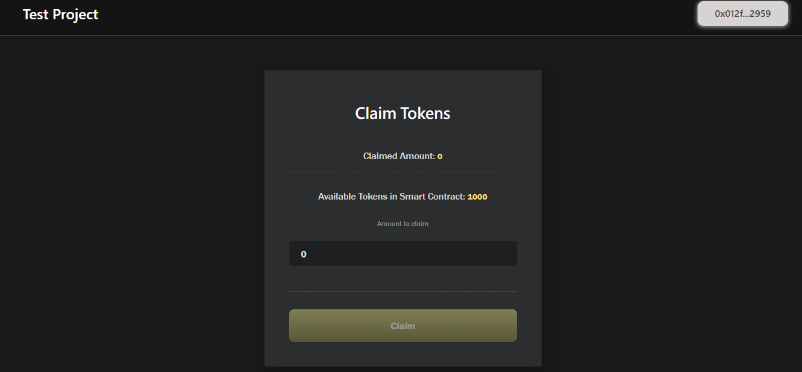
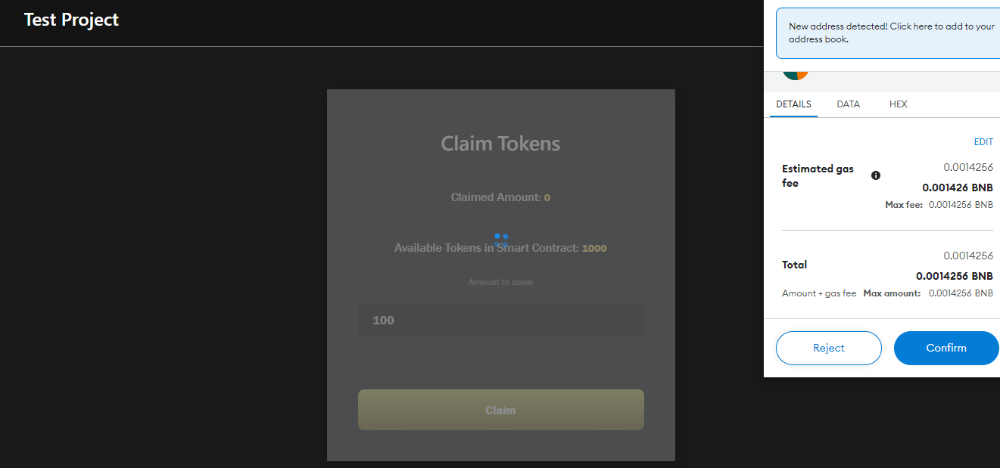
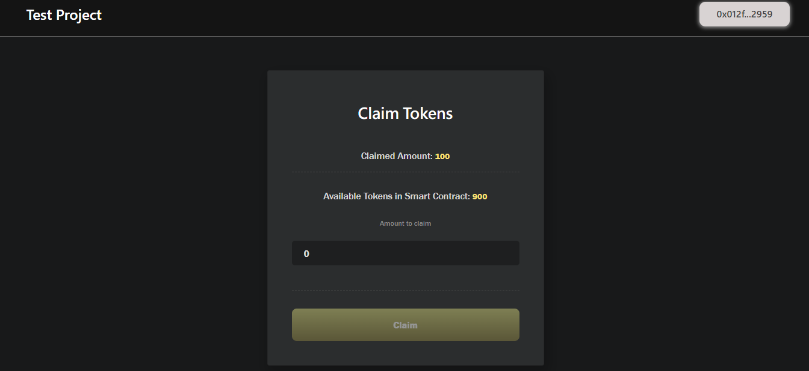

You can see ``addressList`` in proejctdir/smartcontract/scripts/deploy.js
```
let addressList = [
    "0x012F70A63578045aCb880d4C675888594BC12959",
    "0xAb8483F64d9C6d1EcF9b849Ae677dD3315835cb2",
    "0x4B20993Bc481177ec7E8f571ceCaE8A9e22C02db",
    "0x78731D3Ca6b7E34aC0F824c42a7cC18A495cabaB",
    "0x617F2E2fD72FD9D5503197092aC168c91465E7f2"
  ];
```
Modify these addresses if you want

```
$ cd smartcontract
$ yarn install
$ yarn compile
```
```
$ yarn deploy
yarn run v1.22.5
warning package.json: License should be a valid SPDX license expression
$ npx hardhat run ./scripts/deploy.js
Contract deployed to: 0xDE3538Ef7aC9A90Ff16cd0f4DDad9E62f62323e7
Done in 1.47s.
```

Copy contract address and paste frontend/.env \
`REACT_APP_CONTRACT_ADDRESS = 0xDE3538Ef7aC9A90Ff16cd0f4DDad9E62f62323e7`

```
$ cd frontend
$ yarn install
$ yarn start
```





